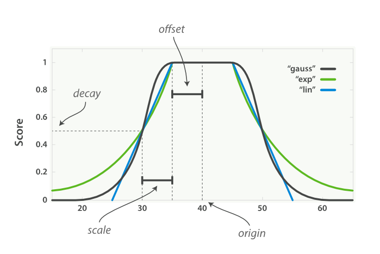

<!--ts-->
* [function score](#function-score)
   * [filter vs query](#filter-vs-query)
   * [boost_mode vs score_mode](#boost_mode-vs-score_mode)
   * [weight](#weight)
   * [field_value_factor](#field_value_factor)
   * [random_score](#random_score)
   * [衰减函数](#衰减函数)
      * [属性](#属性)
      * [举个栗子](#举个栗子)
      * [衰减函数的 3 种模式](#衰减函数的-3-种模式)
   * [script_score](#script_score)
      * [暗戳戳影响搜索结果](#暗戳戳影响搜索结果)
      * [使用 param 来解耦](#使用-param-来解耦)
   * [多个 functions 合作](#多个-functions-合作)
      * [第一个例子是类似于大众点评的餐厅应用](#第一个例子是类似于大众点评的餐厅应用)
      * [新浪微博的社交网站](#新浪微博的社交网站)
* [原文搬运](#原文搬运)

<!-- Created by https://github.com/ekalinin/github-markdown-toc -->
<!-- Added by: jianguo.ouyang, at: Fri Jan 13 18:39:15 CST 2023 -->

<!--te-->

# function score
是一个自定义打分函数的query

fsq(function score query) 的结构大致如下：
```json
{
  "filter": {},
  "query": {},
  "functions": [],
  "boost_mode": "sum",
  "score_mode": "sum",
  "field_value_factor": {},
  "random_score": {},
  "script_score": {}
}
```
下面会一一介绍。

## filter vs query
有些时候我们无须使用全文搜索，只想找到 es 字段中包含 query 的所有文档，逻辑用过滤比用查询表达更清晰。

过滤器返回的所有文档的评分 _score 的值为 1 。 

function_score 查询接受 query 或 filter ，如果没有特别指定，则默认使用 `match_all` 查询。

## boost_mode vs score_mode

首先，每个文档由定义的函数打分。

参数 `score_mode` 规定计算的分数如何组合：

|类型|解释|
|:---|:---|
|multiply | 分数相乘（默认）|
|sum|得分相加|
|avg|平均分数|
|first |使用具有匹配过滤器的第一个函数|
|max|最大得分|
|min|最小分数|

因为有可能会用到 `functionscore(fsq)` 来替换es 默认打分，这里引进了`boost_mode`。

新计算的分数与查询的分数相组合，参数 `boost_mode`定义其组合方式：

|类型|解释|
|:---|:---|
|multiply|查询得分和函数得分相乘（默认）|
|replace|仅使用函数得分，忽略查询得分|
|sum|查询得分和函数得分相加|
|avg|取平均值|
|max|查询得分和函数得分的最大值|
|min|查询得分和函数得分的最小值|


## weight
设置权重，我印象中每次都是用于多functions中的 filter + weight 打分，命中一个加 N 分，类似这样子。
dsl：
```text
GET /_search
{
  "query": {
    "function_score": {
      "filter": {
        "term": { "city": "Barcelona" }
      },
      "functions": [
        {
          "filter": { "term": { "features": "wifi" }},
          "weight": 1
        },
        {
          "filter": { "term": { "features": "garden" }},
          "weight": 1
        },
        {
          "filter": { "term": { "features": "pool" }},
          "weight": 2
        }
      ],
      "score_mode": "sum"
    }
  }
}
```


## field_value_factor
将某个字段的值进行计算得出分数。

* field 指定某个字段
* factor 对字段初始值的预处理，乘以指定数值，默认是 1
* modifier 用什么方法来修正分数：
    * none：不处理
    * log：计算对数
    * log1p：先将字段值 +1，再计算对数
    * log2p：先将字段值 +2，再计算对数
    * ln：计算自然对数
    * ln1p：先将字段值 +1，再计算自然对数
    * ln2p：先将字段值 +2，再计算自然对数
    * square：计算平方
    * sqrt：计算平方根
    * reciprocal：计算倒数
  
举个栗子： 有一个需求，门店看得人越多，就越靠前，但是要避免马太效应，所以不能无脑根据门店的查看数倒序。
请问怎么办？

假设门店有一个字段：`view_num`，我们自定义分数：
```text
GET /store/_search
{
  "query": {
    "function_score": {
      "query": {
        "multi_match": {
          "query": "kfc",
          "fields": ["tile", "content"]
        }
      },
      "field_value_factor": {
        "field": "view_num",
        "modifier": "log1p",
        "factor": 0.5
      },
      "boost_mode": "sum",
      "max_boost": 2
    }
  }
}
```
解读下：
* log1p是一个函数，用于对字段分数进行修正：
    ```
    new_score = old_score * log(1 + factor * follower_num)
    ```
* boost_mode，用于决定最终doc分数与指定字段的值如何计算：
    ```
    multiply，sum，min，max，replace
    ```
* max_boost，用于限制计算出来的分数不要超过max_boost指定的值。

## random_score
随机得到 0 到 1 分数，我本来也不是很理解这个东西的使用场景，直到看到这个需求：
```text
作为网站的所有者，总会希望让广告有更高的展现率。
在当前查询下，有相同评分 _score 的文档会每次都以相同次序出现。
为了提高展现率，在此引入一些随机性可能会是个好主意，这能保证有相同评分的文档都能有均等相似的展现机率。

我们想让每个用户看到不同的随机次序，但也同时希望如果是同一用户翻页浏览时，结果的相对次序能始终保持一致。
这种行为被称为 一致随机（consistently random）。

random_score 函数会输出一个 0 到 1 之间的数， 当种子 seed 值相同时，生成的随机结果是一致的。
例如，将用户的会话 ID 作为 seed。
```
dsl 如下：
```text
GET /_search
{
  "query": {
    "function_score": {
      "random_score": {
        "seed": 10,
        "field": "_seq_no"
      }
    }
  }
}
```
复杂的 dsl 如下：
```text
GET /_search
{
  "query": {
    "function_score": {
      "filter": {
        "term": { "city": "Barcelona" }
      },
      "functions": [
        {
          "filter": { "term": { "features": "wifi" }},
          "weight": 1
        },
        {
          "filter": { "term": { "features": "garden" }},
          "weight": 1
        },
        {
          "filter": { "term": { "features": "pool" }},
          "weight": 2
        },
        {
          "random_score": { 
            "seed":  "the users session id" 
          }
        }
      ],
      "score_mode": "sum"
    }
  }
}
```
这个 dsl 实现了：
* random_score 语句没有任何过滤器 filter ，所以会被应用到所有文档。
* 将用户的会话 ID 作为种子 seed ，让该用户的随机始终保持一致，相同的种子 seed 会产生相同的随机结果。


## 衰减函数
同样以某个字段的值为标准，距离某个值越近得分越高
### 属性
* 原点（origin）：该字段最理想的值，这个值可以得到满分（1.0）
* 偏移量（offset）：与原点相差在偏移量之内的值也可以得到满分
* 衰减规模（scale）：当值超出了原点到偏移量这段范围，它所得的分数就开始进行衰减了，衰减规模决定了这个分数衰减速度的快慢
* 衰减值（decay）：该字段可以被接受的值（默认为 0.5），相当于一个分界点，具体的效果与衰减的模式有关
### 举个栗子
例子1:
* 买东西，心理预期价格 50 元
* 但是我们不可能非 50 元就不买，而是会划定一个可接受的价格范围，例如 45-55 元，±5 就为偏移量
* 当价格超出了可接受的范围，就会让人觉得越来越不值。如果价格是 70 元，评价可能是不太想买，而如果价格是 200 元，评价则会是不可能会买，这就是由衰减规模和衰减值所组成的一条衰减曲线

例子 2：
* 我们想租一套房，它的理想位置是公司附近
* 如果离公司在 5km 以内，是我们可以接受的范围，在这个范围内我们不去考虑距离，而是更偏向于其他信息
* 当距离超过 5km 时，我们对这套房的评价就越来越低了，直到超出了某个范围就再也不会考虑了


### 衰减函数的 3 种模式
* 线性函数（linear）
* 以 e 为底的指数函数（Exp）
* 高斯函数（gauss）



例子 2的 dsl:
```json
{
  "query":
  {
    "function_score":
    {
      "query":
      {
        "match":
        {
          "title": "公寓"
        }
      },
      "gauss":
      {
        "location":
        {
          "origin":
          {
            "lat": 40,
            "lon": 116
          },
          "offset": "5km",
          "scale": "10km"
        }
      },
      "boost_mode": "sum"
    }
  }
}
```


## script_score
通过自定义脚本计算分值。


### 暗戳戳影响搜索结果
假设我们有一批门店，用户搜索 `云南大理`，我就想把云南大理的门店给推给他们。

此时此刻，有一个活动，要宣传电影节，我们想要把类别为电影院的门店（es 字段：category）提到靠前的地方。

要求是，暗戳戳去影响搜索结果，不能明目张胆得把非电影院的都 filter 掉。

想了下，应该用 `boost` 之类的给电影院的提分，难道用：
```json
{
  "query": {
    "match": {
      "category": "电影院",
      "boost": 2.0
    }
  }
}
```

不行啊，人家根本不会搜`电影院`，人家搜的都是`天安门`,`kfc`, `附近五星`。

我又不能直接把电影院加到 query 中，怎么才能做到`暗戳戳`的影响呢？

这时用 `field_value_factor` 和 `weight` 貌似都做不到啊。

怎么办呢？

在 dsl 中使用 script_score:
```json
{
  "query": {
    "function_score": {
      "query": {
        "match": {
          "name": "天安门"
        }
      },
      "script_score": {
        "script": "return doc ['category'].value == '电影院' ? 1.1 : 1.0"
      }
    }
  }
}
```
或者把script保存到：`elasticsearch/config/scripts`，然后 dsl 引用它：
```json
{
  "query": {
    "function_score": {
      "query": {
        "match": {
          "name": "天安门"
        }
      },
      "script_score": {
        "script": {
         "file": "category-score"
        }
      }
    }
  }
}
```


### 使用 param 来解耦
我们不要可以把参数从script中提出来，稍微做到了解耦：
```json
{
  "query": {
    "function_score": {
      "query": {
        "match": {
          "name": "天安门"
        }
      },
      "script_score": {
        "script": {
          "source": "return doc ['category'].value == recommend_category ? 1.1 : 1.0",
          "params": {
            "recommend_category": "电影院"
          }
        }
      }
    }
  }
}
```
或者用 file 的方式，不用去改动脚本的内容，也是解耦：
```json
{
  "query": {
    "function_score": {
      "query": {
        "match": {
          "name": "天安门"
        }
      },
      "script_score": {
        "script": {
         "file": "category-score",
         "params": {
            "recommend_category": "电影院"
         }
        }
      }
    }
  }
}
```

## 多个 functions 合作

### 大众点评的餐厅应用

该应用希望向用户推荐一些不错的餐馆，特征是：
* 范围要在当前位置的 5km 以内
* 有停车位是最重要的
* 有 Wi-Fi 更好
* 餐厅的评分（1 分到 5 分）越高越好
* 并且对不同用户最好展示不同的结果以增加随机性

dsl 如下：
```text
{
  "query": {
    "function_score": {
      "filter": {
        "geo_distance": {
          "distance": "5km",
          "location": {
            "lat": $lat,
            "lon": $lng
          }
        }
      },
      "functions": [
        {
          "filter": {
            "term": {
              "features": "wifi"
            }
          },
          "weight": 1
        },
        {
          "filter": {
            "term": {
              "features": "停车位"
            }
          },
          "weight": 2
        },
        {
            "field_value_factor": {
               "field": "score",
               "factor": 1.2
             }
        },
        {
          "random_score": {
            "seed": "$id"
          }
        }
      ],
      "score_mode": "sum",
      "boost_mode": "multiply"
    }
  }
}
```

### 新浪微博的社交网站
现在要优化搜索功能，使其以文本相关度排序为主，但是：
* 越新的微博会排在相对靠前的位置
* 点赞（忽略相同计算方式的转发和评论）数较高的微博也会排在较前面
* 如果这篇微博购买了推广并且是创建不到 24 小时（同时满足），它的位置会非常靠前。

dsl如下：
```text
{
  "query": {
    "function_score": {
      "query": {
        "match": {
          "content": "$text"
        }
      },
      "functions": [
        {
          "gauss": {
            "createDate": {
              "origin": "$now",
              "scale": "6d",
              "offset": "1d"
            }
          }
        },
        {
          "field_value_factor": {
            "field": "like_count",
            "modifier": "log1p",
            "factor": 0.1
          }
        },
        {
          "script_score": {
            "script": "return doc ['is_recommend'].value && doc ['create_date'] > time ? 1.5 : 1.0",
            params: {
                "time": $time
            }
          }
        }
      ],
      "boost_mode": "multiply"
    }
  }
}
```

公式：
```text
_score * gauss (create_date, $now, "1d", "6d") * log (1 + 0.1 * like_count) * (is_recommend & doc ['create_date'] > time  ? 1.5 : 1.0)
```


# 原文搬运
* [通过Function Score Query优化Elasticsearch搜索结果](https://www.scienjus.com/elasticsearch-function-score-query/)
* [随机评分 | Elasticsearch: 权威指南 | Elastic](http://www.lvesu.com/blog/es/random-scoring.html)
* [官网文档function score](https://www.elastic.co/guide/en/elasticsearch/reference/current/query-dsl-function-score-query.html)